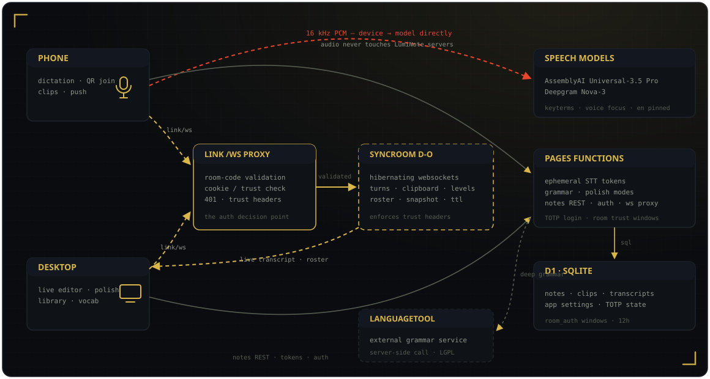

<div align="center">



[](https://github.com/rakxdev/LumiNote/actions/workflows/ci.yml)


[](https://cloudflare-v04.luminote-v2.pages.dev/)

[Open the Studio](https://cloudflare-v04.luminote-v2.pages.dev/) · [Changelog](https://cloudflare-v04.luminote-v2.pages.dev/changelog) · [Credits](https://cloudflare-v04.luminote-v2.pages.dev/credits) · [Contributing](CONTRIBUTING.md)

</div>

---

## Why LumiNote?

Dictation tools are either clunky batch uploaders, subscription-walled, or locked to one device. LumiNote is a **free, open, browser-native studio** where you dictate on your phone and the text appears **live on your desktop** — with the audio never passing through its servers (it streams device → speech model directly). Built with pure vanilla JavaScript, native Web Audio, and Cloudflare's edge. No accounts, no frameworks, no build step.

## Features

| | |
|---|---|
|  **Streaming STT** | AssemblyAI Universal-3.5 Pro (default) and Deepgram Nova-3, switched live; English-pinned sessions tuned for quiet voices |
|  **Link Mode** | Pair any two devices with a QR or 6-character code; live transcript + clipboard relay, room trust windows, self-healing connections |
|  **Voice commands** | "new paragraph", "new line", "scratch that" — executed, not transcribed |
|  **Vocabulary & corrections** | Exact-spelling keyterms plus a personal "heard = written" dictionary applied to every sentence |
|  **Output modes** | Polish AI into Clean, Bullets, or Email scaffolds |
|  **Durable library** | Notes, clips, and transcripts in Cloudflare D1 — searchable, pinnable, exportable as Markdown/JSON |
|  **Authenticator login** | Optional TOTP gate for device linking, with recovery codes and self-service reset |
|  **Installable PWA** | Home-screen app with an offline shell that never caches API or socket traffic |
|  **Truthful visuals** | dB-mapped voice meters on *both* devices, presence-driven link states, zero fake animations |
|  **Zero-trust auth** | Ephemeral STT tokens, no master keys client-side, zero third-party requests |

<details>
<summary><strong>All capabilities in detail</strong></summary>

- **Vāk & Nāda design** — RodeX precision × Sanskrit acoustics; Dark (Obsidian & Brass) and Light (Silk & Red Lacquer) themes.
- **Truthful voice meters** — 12 dB-mapped, log-spaced FFT bands with fast attack/slow release; the second device's meter follows the recording device's voice over the link ([ADR-001](docs/decisions/ADR-001-synthetic-oscilloscope.md)).
- **Link Mode** — hibernating-WebSocket `SyncRoom` Durable Object, snapshot catch-up, sliding 12h rooms, authoritative device rosters, role-slot replacement, heartbeat + resume liveness probes ([ADR-003](docs/decisions/ADR-003-link-mode-cross-device-sync.md)).
- **Room trust windows** — a verified device unlocks its room for 12h; other devices join with just the code ([ADR-005](docs/decisions/ADR-005-totp-authenticator-login.md)).
- **Push, both places** — pushes land in the peer's editor *and* clipboard tray; fresh pushes are captured as clips.
- **Durable library** — hash-routed Notes/Clips/Transcripts views; recording survives navigation; transcript auto-save ([ADR-004](docs/decisions/ADR-004-d1-saved-library.md)).
- **Self-service authenticator** — enroll by QR, 8 one-time recovery codes, owner reset with a current code.
- **One version source** — `changelog.json` drives the `/changelog` page and the header seal (enforced by tests).
- **Self-contained frontend** — self-hosted fonts and libraries, zero third-party requests, always-revalidate cache ([ADR-006](docs/decisions/ADR-006-installable-shell-cache-policy.md)).
- **Leak-free audio lifecycle** — full AudioWorklet teardown on switches/disconnects/unloads, tail flush so the last word survives, and a screen wake lock so phones don't sleep mid-dictation.
- **Safe grammar engine** — LanguageTool proxy with rules that preserve legitimate English ("like", "had had", "Node.js").
- **Local draft resilience** — the transcript autosaves and survives crashes.
- **Quiet-voice accuracy** — English-pinned sessions, lowered VAD threshold, near-field Voice Focus, browser mic auto-gain.
- **Mobile ergonomics** — 44px touch targets, no iOS focus zoom, `viewport-fit=cover` for notch/home-bar safety.

</details>

## Quick Start

**Use it:** open the [live studio](https://cloudflare-v04.luminote-v2.pages.dev/), click **Link** on both devices, scan the QR — dictate on your phone.

**Develop it:**

```bash
git clone https://github.com/rakxdev/LumiNote && cd LumiNote
npm install                      # Node 22
cp .dev.vars.example .dev.vars   # add your ASSEMBLYAI_API_KEY / DEEPGRAM_API_KEY
npm run dev                      # app + Functions on localhost
npm run dev:sync                 # second terminal: relay Worker
```

**Verify:** `npm run check:fast` (lint + floor, <5s) · `npm run check:task` (tests + ratchets, <90s) · `npm run check:full` (deep scan).

Full setup (D1, secrets, deployment) in the [Contributing guide](CONTRIBUTING.md).

## Architecture



Decisions and their reasoning live in [`docs/decisions/`](docs/decisions/) (ADR-001 → ADR-006).

## Documentation

| | |
|---|---|
| [Live app](https://cloudflare-v04.luminote-v2.pages.dev/) · [Changelog](https://cloudflare-v04.luminote-v2.pages.dev/changelog) · [Credits](https://cloudflare-v04.luminote-v2.pages.dev/credits) | The product and its release history |
| [docs/decisions/](docs/decisions/) | Architecture Decision Records (ADR-001 → 006) |
| [CONTRIBUTING.md](CONTRIBUTING.md) · [CODE_OF_CONDUCT.md](CODE_OF_CONDUCT.md) | Contributing and conduct |
| [CONSTRAINTS.md](CONSTRAINTS.md) | The enforced quality bar (floor + ratchets) |
| [DESIGN.md](DESIGN.md) | The visual design system |

## Contributing

Contributions are welcome — see [CONTRIBUTING.md](CONTRIBUTING.md). In short: one logical change per commit, verification gates green, `CONSTRAINTS.md` never weakened, English everywhere. By contributing you agree your work is licensed under the [MIT License](LICENSE).

## License

[MIT](LICENSE) © 2026 rakxdev. Vendored libraries and typefaces keep their own notices — see the [credits page](https://cloudflare-v04.luminote-v2.pages.dev/credits).
